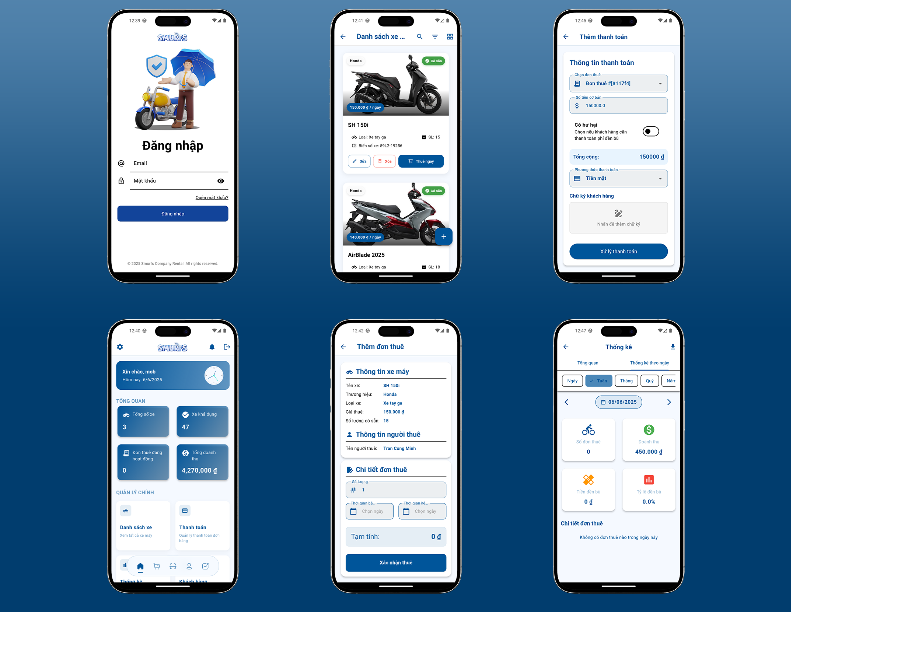
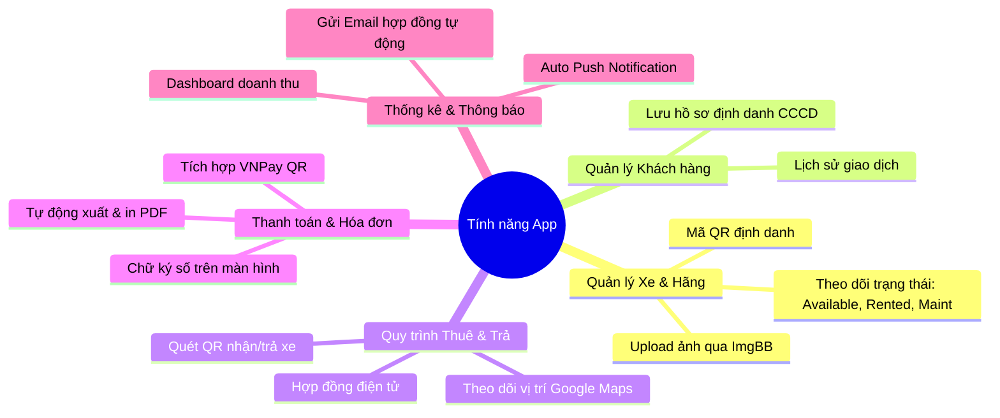
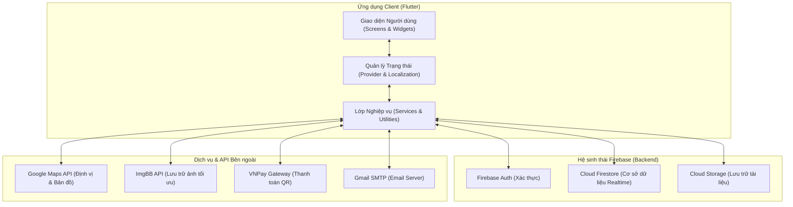
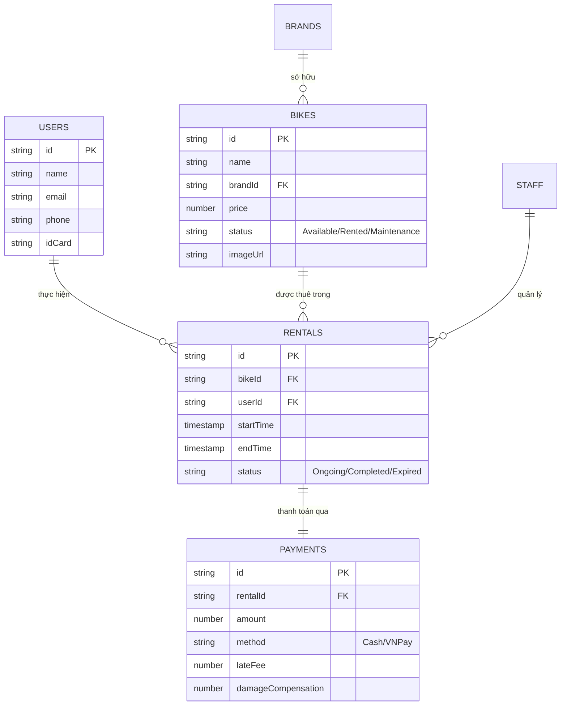
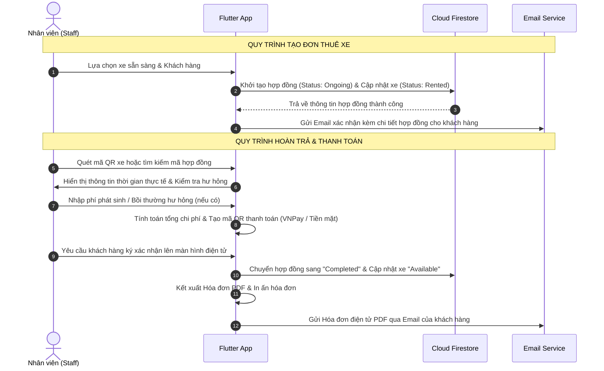

<div align="center">
  
  <h1>🏍️ Motorbike Rental Management</h1>
  <p><strong>Hệ sinh thái quản lý cho thuê xe máy toàn diện dành cho nhân viên và doanh nghiệp</strong></p>

  <p>
    
    
    
    
    
  </p>
</div>

<br />



---

## 📑 Bảng Mục Lục

1. [Tiêu đề & Thông tin Đồ án](#1-tiêu-đề--thông-tin-đồ-án)
2. [Giới thiệu Dự án](#2-giới-thiệu-dự-án)
3. [Tính năng Chính](#3-tính-năng-chính)
4. [Kiến trúc Tổng quan](#4-kiến-trúc-tổng-quan)
5. [Cài đặt Môi trường](#5-cài-đặt-môi-trường)
6. [Chạy Dự án](#6-chạy-dự-án)
7. [Cấu hình Môi trường (Environment)](#7-cấu-hình-môi-trường-environment)
8. [Cấu trúc Thư mục](#8-cấu-trúc-thư-mục)
9. [Hướng dẫn Đóng góp](#9-hướng-dẫn-đóng-góp)
10. [Giấy phép (License)](#10-giấy-phép-license)

---

## 1. 🎓 Tiêu đề & Thông tin Đồ án

Dự án **Ứng dụng Quản lý Cho thuê Xe máy (Motorbike Rental App)** được phát triển nhằm mục đích phục vụ công tác quản lý nghiệp vụ thuê xe máy chuyên nghiệp tại các cửa hàng, cơ sở kinh doanh thuê xe.

* **Môn học:** Lập trình Di động
* **Đơn vị đào tạo:** Trường Đại học Công Thương TP.HCM (HUIT)
* **Nhóm phát triển:**
  * **Trần Công Minh** - `2001222641` (Nhóm trưởng - *Architecture & Core Services*)
  * **Lê Đức Trung** - `2001225676` (*UI/UX & Payment Integration*)
  * **Nguyễn Chí Tài** - `2001224227` (*Database & Authentication*)
  * **Tạ Nguyên Vũ** - `2001225916` (*Maps tracking & Notification*)

---

## 2. 🌟 Giới thiệu Dự án

Trong kỷ nguyên số hóa, việc quản lý cho thuê phương tiện theo cách truyền thống (sử dụng giấy tờ, sổ sách) dễ dẫn đến thất thoát dữ liệu, khó kiểm soát tình trạng xe và tính toán sai lệch chi phí trễ hạn.

**Motorbike Rental Management App** ra đời nhằm giải quyết triệt để các vấn đề trên thông qua một ứng dụng di động trực quan, mạnh mẽ và tự động hóa toàn bộ quy trình: từ tiếp nhận khách hàng, kiểm tra giấy tờ eKYC, tạo hợp đồng thuê, theo dõi tình trạng xe qua bản đồ GPS, cho đến thanh toán QR không tiền mặt và xuất hóa đơn điện tử PDF.

### 🎯 Đối tượng sử dụng
* **Quản trị viên (Admin):** Giám sát toàn bộ hoạt động kinh doanh, thống kê doanh thu, quản lý tài khoản và phân quyền nhân viên.
* **Nhân viên (Staff):** Thực hiện các thao tác vận hành hàng ngày: giao/nhận xe, kiểm tra khách hàng, quét mã QR, thanh toán và in hóa đơn.

---

## 3. 🚀 Tính năng Chính

Ứng dụng sở hữu bộ tính năng hoàn chỉnh, đáp ứng mọi nhu cầu khắt khe của mô hình kinh doanh thuê xe hiện đại:



### 🏍️ Quản lý Danh mục Xe & Thương hiệu
* **Quản lý đa dạng:** Thêm, sửa, xóa thông tin chi tiết các mẫu xe và hãng xe.
* **Theo dõi trạng thái theo thời gian thực:** Phân loại rõ ràng tình trạng `Available` (Sẵn sàng), `Rented` (Đang cho thuê), `Maintenance` (Đang bảo dưỡng).
* **Tích hợp hình ảnh & QR:** Upload ảnh phương tiện tự động lên hệ thống lưu trữ đám mây, tự động sinh và quét mã QR định danh cho từng xe.

### 👥 Quản lý Khách hàng (CRM)
* **Hồ sơ khách hàng:** Quản lý thông tin định danh người thuê bao gồm số CCCD/Passport, họ tên, địa chỉ, số điện thoại.
* **Lịch sử giao dịch:** Tra cứu nhanh lịch sử thuê xe, theo dõi mức độ uy tín và các khoản thanh toán của từng khách hàng.

### 📜 Quản lý Đơn thuê (Rental Workflow)
* **Tạo đơn nhanh chóng:** Giao diện trực quan cho phép chọn xe, áp dụng khách hàng và thiết lập thời gian bắt đầu/kết thúc chỉ với vài lượt chạm.
* **Quản lý chu trình sống của đơn:** Theo dõi trạng thái từ `Ongoing` (Đang diễn ra) sang `Completed` (Đã hoàn thành) hoặc `Expired` (Đã trễ hạn).
* **Định vị & Bản đồ:** Tích hợp Google Maps theo dõi vị trí xe trực tiếp và định vị cửa hàng giao/nhận xe.

### 💳 Thanh toán & Xuất Hóa đơn Đa năng
* **Công cụ tính phí thông minh:** Tự động tính toán tiền thuê gốc, phí trễ hạn (nếu có) và tiền bồi thường hư hỏng phương tiện.
* **Cổng thanh toán hiện đại:** Hỗ trợ thanh toán tiền mặt truyền thống hoặc mã QR trực tuyến qua cổng **VNPay**.
* **Chữ ký điện tử:** Khách hàng ký xác nhận biên bản giao/trả xe trực tiếp trên màn hình cảm ứng điện thoại hoặc máy tính bảng.
* **Hóa đơn & Báo cáo PDF:** Tự động kết xuất hóa đơn thanh toán và hợp đồng dưới dạng PDF chuyên nghiệp, hỗ trợ chia sẻ qua Zalo/Email hoặc in trực tiếp qua máy in không dây (AirPrint / Mopria).

### 🔔 Thông báo, Báo cáo & Phân quyền
* **Thông báo tự động:** Hệ thống tự động gửi Push Notification và Email cảnh báo khi hợp đồng sắp hết hạn hoặc đã quá hạn.
* **Dashboard Phân tích:** Trực quan hóa doanh thu theo ngày/tháng/năm bằng biểu đồ đồ thị đẹp mắt.
* **Phân quyền chặt chẽ:** Admin có toàn quyền quản trị hệ thống, cấp phát hoặc vô hiệu hóa tài khoản nhân viên.

---

## 4. 🏗️ Kiến trúc Tổng quan

Hệ thống được thiết kế theo mô hình **Service-Oriented Architecture (SOA)** kết hợp với kiến trúc phân tầng rõ ràng trong Flutter, sử dụng **Provider** làm cơ chế quản lý trạng thái chính.

### 🌐 Sơ đồ Kiến trúc Hệ thống



### 🗄️ Mô hình Cấu trúc Dữ liệu (Firestore Collections)



### 🔄 Luồng Hoạt động Nghiệp vụ (Workflow)



---

## 5. 🛠️ Cài đặt Môi trường

Để tham gia phát triển hoặc chạy thử nghiệm dự án trên máy trạm của bạn, vui lòng đảm bảo đáp ứng các yêu cầu hệ thống sau:

### 📋 Yêu cầu Hệ thống
* **Hệ điều hành:** Windows, macOS, hoặc Linux.
* **Flutter SDK:** Phiên bản `3.7.2` trở lên (Khuyến nghị sử dụng bản Stable mới nhất).
* **Dart SDK:** Phiên bản `3.0.0` trở lên.
* **IDE:** VS Code (đã cài extension Flutter/Dart) hoặc Android Studio / IntelliJ IDEA.
* **Thiết bị:** Máy ảo Android Emulator / iOS Simulator hoặc thiết bị vật lý kết nối qua cáp / Wi-Fi Debug.

### 📥 Bước 1: Clone Repository
Mở terminal (hoặc Git Bash) và thực hiện sao chép mã nguồn về máy:
```bash
git clone https://github.com/dexter826/motorbike_rental_app.git
cd motorbike_rental_app
```

### 📦 Bước 2: Tải Dependencies
Thực hiện cài đặt các thư viện cần thiết đã được khai báo trong `pubspec.yaml`:
```bash
flutter pub get
```

### 🔥 Bước 3: Thiết lập Firebase & Dịch vụ Nền tảng
Dự án sử dụng Firebase làm hạ tầng dữ liệu và xác thực. Vui lòng thiết lập các tệp cấu hình bảo mật:

1. Tạo một dự án mới trên [Firebase Console](https://console.firebase.google.com/). Kích hoạt các dịch vụ **Authentication** (Email/Password), **Firestore Database**, và **Storage**.
2. Thiết lập tệp cấu hình chung cho ứng dụng Dart:
   ```bash
   # Sao chép file mẫu thành file chính thức
   cp lib/firebase_options.dart.example lib/firebase_options.dart
   ```
   *(Sau đó cập nhật thông tin tương ứng với cấu hình dự án Firebase của bạn).*
3. Đối với nền tảng **Android**:
   ```bash
   cp android/app/google-services.json.example android/app/google-services.json
   ```
4. Đối với nền tảng **iOS**:
   ```bash
   cp ios/Runner/GoogleService-Info.plist.example ios/Runner/GoogleService-Info.plist
   ```

---

## 6. 🚀 Chạy Dự án

Sau khi hoàn tất cấu hình, bạn có thể khởi chạy ứng dụng trực tiếp từ terminal hoặc thông qua tính năng Run/Debug của IDE.

### ⚡ Chạy chế độ Phát triển (Debug Mode)
```bash
# Kiểm tra các thiết bị khả dụng
flutter devices

# Chạy trên thiết bị mặc định
flutter run

# Chạy cụ thể trên thiết bị cụ thể (ví dụ emulator-5554)
flutter run -d emulator-5554
```

### 📦 Xây dựng bản Release (Production Build)
```bash
# Build file APK cho Android (arm64 hoặc app bundle)
flutter build apk --release --split-per-abi

# Build ứng dụng cho iOS (Yêu cầu macOS và Xcode)
flutter build ios --release

# Build phiên bản Web
flutter build web --release
```

---

## 7. ⚙️ Cấu hình Môi trường (Environment)

Hệ thống quản lý các khóa API bảo mật và cấu hình động thông qua tệp `.env` sử dụng thư viện `flutter_dotenv`.

> [!WARNING]
> **Tuyệt đối không đưa tệp `.env` lên các kho lưu trữ công cộng (Git repo).** Tệp này chứa thông tin nhạy cảm của hệ thống.

### 📝 Bảng Cấu hình Biến Môi trường

Sao chép tệp `.env.example` thành `.env` tại thư mục gốc của dự án:
```bash
cp .env.example .env
```

Nội dung chi tiết và giải thích ý nghĩa các biến trong `.env`:

```ini
# ==========================================
# CẤU HÌNH GỬI EMAIL TỰ ĐỘNG (SMTP)
# ==========================================
# Địa chỉ email hệ thống dùng để gửi thông báo/hóa đơn cho khách hàng
EMAIL_USERNAME=your_company_email@gmail.com

# Mật khẩu ứng dụng (App Password) sinh từ tài khoản Google (không dùng mật khẩu gốc)
EMAIL_PASSWORD=your_google_app_password_here

# Máy chủ SMTP mặc định của Google Gmail
EMAIL_HOST=smtp.gmail.com
EMAIL_PORT=587

# Tên doanh nghiệp hiển thị trên tiêu đề Hóa đơn & Email
COMPANY_NAME="Motorbike Express Rental JSC"

# ==========================================
# CẤU HÌNH BẢN ĐỒ & ĐỊNH VỊ (GOOGLE MAPS)
# ==========================================
# API Key lấy từ Google Cloud Console (Đã bật Maps SDK for Android/iOS)
GOOGLE_MAPS_API_KEY=AIzaSyYourRealGoogleMapsApiKeyHere

# ==========================================
# CẤU HÌNH LƯU TRỮ HÌNH ẢNH (IMGBB API)
# ==========================================
# API Key lấy từ trang chủ api.imgbb.com để upload ảnh xe nhanh
IMGBB_API_KEY=your_real_imgbb_api_key_here
```

### 🗺️ Thiết lập riêng cho Google Maps
Ngoài file `.env`, để bản đồ hiển thị chuẩn xác trên Native, bạn cần bổ sung API key vào cấu hình dự án:
* **Android:** Sao chép `android/gradle.properties.example` thành `android/gradle.properties` và điền key.
* **iOS:** Sao chép `ios/Config.xcconfig.example` thành `ios/Config.xcconfig` (Nếu phát triển trên macOS).

---

## 8. 📁 Cấu trúc Thư mục

Dự án áp dụng cấu trúc thư mục quy chuẩn, đảm bảo tính mô-đun hóa cao, dễ dàng bảo trì và mở rộng quy mô mã nguồn khi dự án lớn lên:

```bash
motorbike_rental_app/
├── android/                   # Mã nguồn Native & cấu hình nền tảng Android
├── ios/                       # Mã nguồn Native & cấu hình nền tảng iOS
├── web/                       # Tệp cấu hình cho phiên bản Web App
├── assets/                    # Tài nguyên tĩnh của ứng dụng
│   ├── animations/            # Các file hiệu ứng động Lottie JSON
│   ├── fonts/                 # Bộ font chữ tiêu chuẩn (Roboto, etc.)
│   ├── images/                # Hình ảnh minh họa, logo, banner, avatar mặc định
│   └── translations/          # Tệp đa ngôn ngữ (vi.json, en.json)
├── lib/                       # Mã nguồn cốt lõi (Dart / Flutter)
│   ├── config/                # Định nghĩa cấu hình: AppRoutes, AppTheme
│   ├── models/                # Lớp thực thể dữ liệu (Bike, Rental, User, Payment...)
│   ├── providers/             # Lớp quản lý trạng thái toàn cục (ThemeProvider...)
│   ├── services/              # Các dịch vụ giao tiếp API, Firebase, Business Logic
│   │   ├── auth_service.dart
│   │   ├── bike_service.dart
│   │   ├── email_service.dart
│   │   ├── payment_service.dart
│   │   ├── report_service.dart
│   │   └── ...
│   ├── screens/               # Màn hình chức năng phân chia theo từng module
│   │   ├── admin/             # Màn hình quản lý dành riêng cho Admin
│   │   ├── auth/              # Màn hình đăng nhập, quên mật khẩu, đăng ký
│   │   ├── bike/              # Màn hình danh sách xe, chi tiết xe, thêm sửa xe
│   │   ├── home/              # Bảng điều khiển tổng quan (Dashboard)
│   │   ├── payment/           # Màn hình thanh toán, hóa đơn, chữ ký số
│   │   ├── rental/            # Màn hình danh sách đơn, quét QR, tạo hợp đồng
│   │   └── user/              # Màn hình hồ sơ và quản lý khách hàng
│   ├── utils/                 # Các tiện ích dùng chung (AnimationHelper, Dialog...)
│   ├── widgets/               # Các UI Component tái sử dụng (Button, Card, Input...)
│   └── main.dart              # Điểm khởi chạy đầu tiên của toàn bộ ứng dụng
├── pubspec.yaml               # Quản lý cấu hình dự án, thư viện & phiên bản
└── README.md                  # Tài liệu hướng dẫn kỹ thuật hoàn chỉnh
```

---

## 9. 🤝 Hướng dẫn Đóng góp (Contributing)

Chúng tôi vô cùng hoan nghênh sự đóng góp từ cộng đồng và các lập trình viên để hoàn thiện hệ sinh thái quản lý này. Để quy trình phối hợp làm việc trơn tru, vui lòng tuân thủ quy chuẩn sau:

### 🌿 Quy chuẩn Nhánh (Branching Model)
* `main`: Nhánh chứa mã nguồn ổn định nhất (Production-ready). Không trực tiếp đẩy (push) code lên nhánh này.
* `develop`: Nhánh tích hợp các tính năng mới phục vụ kiểm thử.
* `feature/<tên-tính-năng>`: Nhánh phát triển tính năng mới (Ví dụ: `feature/vnpay-integration`).
* `bugfix/<tên-lỗi>`: Nhánh sửa lỗi phát sinh (Ví dụ: `bugfix/fix-pdf-overflow`).

### 💬 Quy chuẩn Commit (Conventional Commits)
Thông điệp commit cần rõ ràng, thể hiện mục đích thay đổi:
* `feat:` Bổ sung một tính năng mới.
* `fix:` Sửa một lỗi trong hệ thống.
* `docs:` Thay đổi hoặc cập nhật tài liệu (README, comments...).
* `style:` Định dạng mã nguồn (khoảng trắng, dấu chấm phẩy, linter... không đổi logic).
* `refactor:` Tái cấu trúc mã nguồn (không thêm tính năng hay sửa lỗi).
* `perf:` Tối ưu hóa hiệu năng ứng dụng.

### 🔄 Quy trình Tạo Pull Request (PR Workflow)
1. Fork dự án về tài khoản của bạn.
2. Tạo nhánh tính năng mới từ `develop` (`git checkout -b feature/amazing-feature`).
3. Commit các thay đổi tuân thủ quy chuẩn (`git commit -m 'feat: bổ sung tính năng xuất báo cáo Excel'`).
4. Đẩy nhánh lên repository của bạn (`git push origin feature/amazing-feature`).
5. Mở một Pull Request hướng vào nhánh `develop` của kho lưu trữ gốc và mô tả chi tiết các thay đổi.

---

## 10. 📄 Giấy phép (License)

Dự án này được phát hành dưới Giấy phép **MIT License**.

Chi tiết đầy đủ về quyền hạn và nghĩa vụ pháp lý, vui lòng tham khảo tệp [LICENSE](LICENSE) đính kèm trong repository.

```
MIT License

Bản quyền (c) 2026 Motorbike Rental App Team - Trường Đại học Công Thương TP.HCM

Được phép miễn phí cho bất kỳ ai nhận được bản sao của phần mềm này và các tệp tài liệu đi kèm 
để sử dụng, sao chép, sửa đổi, hợp nhất, xuất bản, phân phối mà không chịu sự hạn chế nào.
```

---

<div align="center">
  <p>Được xây dựng với 💖 bởi nhóm phát triển đồ án Lập trình Di động - HUIT</p>
  <p>Nếu bạn thấy dự án hữu ích, đừng quên cho repo một ⭐ nhé!</p>
</div>
